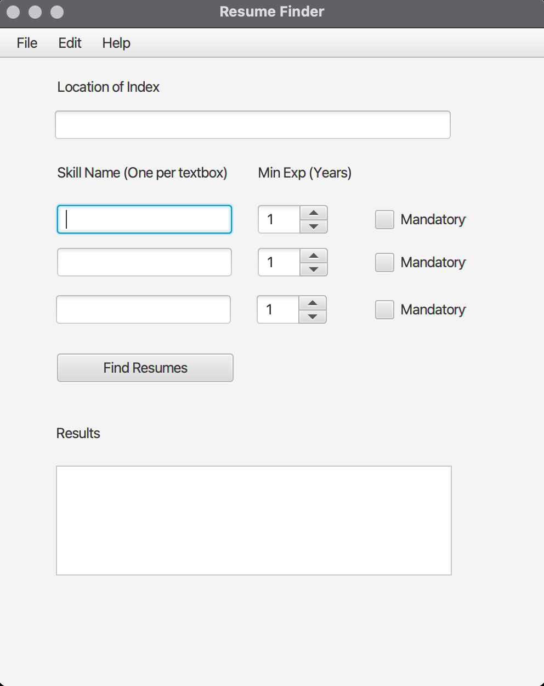

# User Guide - Resume Finder

+ [Prerequisites](#prerequisites)
+ [Build](#build)
+ [Running](#running)
  - [Parsing Engine](#parsing-engine)
  - [Scoring Engine](#scoring-engine)
  - [Search UI](#search-ui)

### Prerequisites

* JDK 14

Use the following commands to confirm the JDK and JRE versions

```bash
~ % javac --version
javac 14.0.2
~ % java --version 
openjdk 14.0.2 2020-07-14
OpenJDK Runtime Environment (build 14.0.2+12-46)
OpenJDK 64-Bit Server VM (build 14.0.2+12-46, mixed mode, sharing)
~ % 
```

### Build

1. Create a workspace directory and change into it

```bash
~ $ mkdir rf-workspace
~ $ cd rf-workspace
rf-workspace $ 
```

2. Clone this repository to the workspace directory

```bash
rf-workspace $ git clone https://github.com/dkrovi2/CourseProject.git
Cloning into 'CourseProject'...
remote: Enumerating objects: 503, done.
remote: Total 503 (delta 0), reused 0 (delta 0), pack-reused 503
Receiving objects: 100% (503/503), 8.60 MiB | 10.04 MiB/s, done.
Resolving deltas: 100% (110/110), done.
rf-workspace $ 
```

3. Navigate to `CourseProject/code/resume-finder` directory
```bash
rf-workspace $ cd CourseProject/code/resume-finder
resume-finder $ 
```

4. This project [`gradle`](http://gradle.org) build tool. Run the following command to build the project:

```bash
resume-finder $ ./gradlew clean build

> Configure project :
Project : => no module-info.java found

BUILD SUCCESSFUL in 2m 45s
11 actionable tasks: 10 executed, 1 up-to-date
resume-finder $
```

The project generates a [`shadow`](https://imperceptiblethoughts.com/shadow/introduction/) jar in `build/libs` directory.

### Running
The module has three main modules:

* **Parsing Engine**: This module takes the directory that contains resumes in PDF/DOC format and parses them to an intermediate JSON representation file, one per resume, that the Scoring Engine understands

* **Scoring Engine**: This module takes the directory that contains the intermediate JSON representation files and indexes them per the scoring algorithm developed in this project

* **Search UI**: This module brings up a Java FX UI to search for resumes

#### Parsing Engine
The usage of the `run-parsing-engine.sh` is 

```bash
resume-finder $ ./run-parse-engine.sh
Usage: run-parse-engine.sh <location of resumes> <location to write JSON files for scoring engine>
resume-finder $ 
```

Sample invocation of parsing engine:

```bash
resume-finder $ mkdir artifacts
resume-finder $ cp -R ../samples/Resumes artifacts/Resumes
resume-finder $ ./run-parse-engine.sh artifacts/Resumes artifacts/JSON
Running the parse engine for resumes at artifacts/Resumes. The JSON files for scoring engine will be available at artifacts/JSON
23:32:26.871 [main] INFO  e.illinois.phantom.parseengine.Main - Parsing resumes...
23:32:26.939 [main] INFO  e.i.phantom.parseengine.ResumeParser - Parsing resume file at artifacts/Resumes/.....
...
23:32:51.092 [main] INFO  e.illinois.phantom.parseengine.Main - Finished parsing resumes!
resume-finder $ 
```

#### Scoring Engine
The usage of the `run-scoring-engine.sh` is 

```bash
resume-finder $ ./run-scoring-engine.sh
Usage: run-scoring-engine.sh <location to write JSON files for scoring engine> <location of index>
resume-finder $ 
```

Sample invocation of parsing engine:

```bash
resume-finder $ ./run-scoring-engine.sh artifacts/Json artifacts/INDEX
Running the scoring engine for JSON files at artifacts/Json. The Lucene Index will be stored at artifacts/INDEX
23:39:33.668 [main] INFO  e.i.p.analysisengine.ScoringEngine - Added .....
...
resume-finder $ 
```

#### Search UI

The `run-search-ui.sh` command does not need any arguments:

```bash
resume-finder $ ./run-search-ui.sh 
Dec 06, 2021 11:40:29 PM com.sun.javafx.application.PlatformImpl startup
WARNING: Unsupported JavaFX configuration: classes were loaded from 'unnamed module @1e77e32d'
```

Upon successful execution of the above command, the Search UI should appear:



