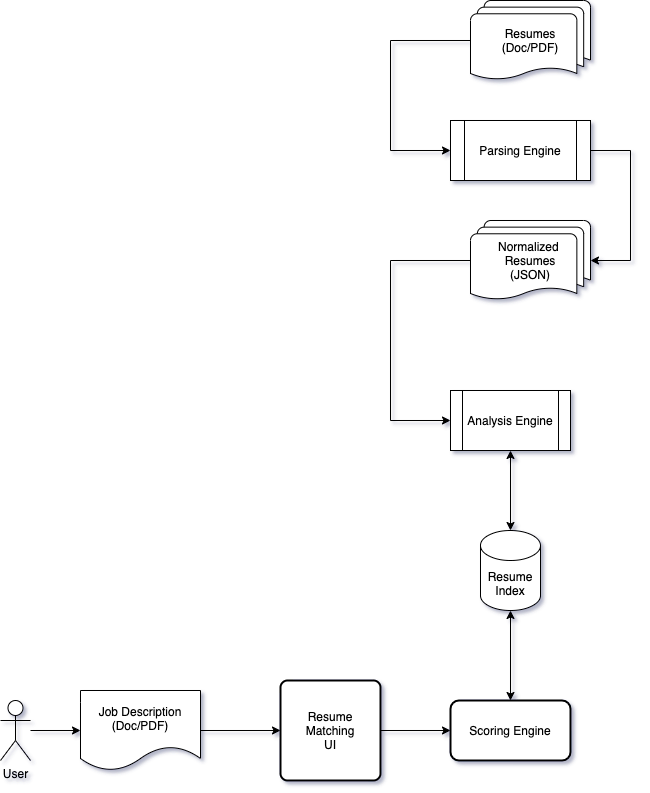

# Progress Report: Build Experience Profiles from Resumes

  - [High-level Tasks](#high-level-tasks)
  - [Tasks Completed](#tasks-completed)
  - [Tasks In Progress](#tasks-in-progress)
  - [Tasks Pending](#tasks-pending)
  - [Current Challenges](#current-challenges)

## High-level Tasks

The following are the key milestones identified for this project: 

| Task                                                          |  Time needed |             ETA |
|:--------------------------------------------------------------|-------------:|----------------:|
| Gather representative data set for training and evaluation    |      8 hours |          Nov  8 |
| Parsing engine to parse resumes and job descriptions          |     20 hours |          Nov 15 |
| Progress report                                               |      2 hours |          Nov 15 |
| Analysis engine to analyze resumes                            |     30 hours |          Nov 22 |
| Scoring engine to match resumes to provided job description   |     30 hours |          Nov 29 |
| Basic UI to search for resumes matching a job description     |     24 hours |          Dec  5 |
| Software documentation                                        |      8 hours |          Dec  9 |
| **Total**                                                     |**122 hours** |                 |

Please use the the following architecture diagram as a reference for the discussion below:

## Tasks Completed

> Gather representative data set for training and evaluation

This task has been completed. The dataset gathered contains resumes from multiple departments. We are confident this corpus is large enough to demonstrate the core idea of the project.

## Tasks In Progress 

> Parsing engine to parse resumes and job descriptions

Two members are currently working on implementing the parsing engine module that takes
  * resumes and extracts information, in a batch and online mode
  * job-description and extracts information in online mode for matching/searching at runtime

> Analysis engine to analyze resumes

Two members are currently working on implementing the analysis engine, using the interface defined between the parsing and analysis engine, w.r.t the output format of the parsing engine.

## Tasks Pending

The following tasks are pending start:

* Scoring engine
  * Implement the [Apache Lucene's TFIDFSimilarity](https://lucene.apache.org/core/8_10_0/core/org/apache/lucene/search/similarities/TFIDFSimilarity.html) to score the documents.
* Basic UI
  * User specifies a job-description to get the ranked resumes as response
* Documentation

## Current Challenges

* A thorough analysis on how to give more weight to a skill that occurs less no of times in document, but the candidate worked on those skills for multiple years.

